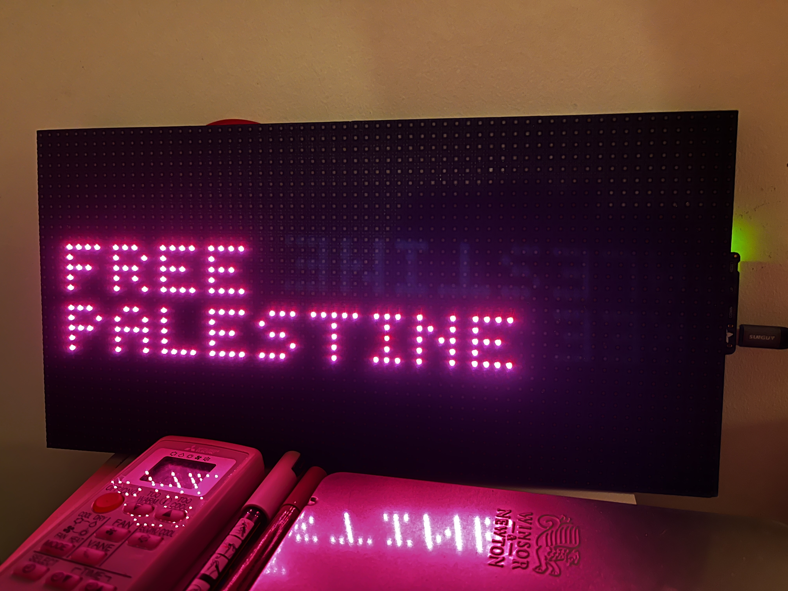

<<<<<<< HEAD
# Free Palestine LED Sign
=======
# FreePalestine_LED
>>>>>>> ccd3c64e6ed41f6201fc78f49bf7ba22dbd17671

This repository contains the code for an LED matrix display project using the Adafruit MatrixPortal M4 and a 32x64 LED panel. The display shows images and phrases in solidarity with the people of Palestine as part of the Free Palestine movement.

The code is based on "LED Matrix Display for Bitmap Pixel Art and Animation" by John Park, with modifications to support the pro-Palestine movement's messaging and imagery.

  

## Getting Started

These instructions will get you a copy of the project up and running on your local machine for development and testing purposes.

### Prerequisites

- Adafruit MatrixPortal M4
- 32x64 RGB LED Matrix panel
- Micro USB cable for power and programming
- Adafruit CircuitPython for MatrixPortal M4
- Necessary CircuitPython libraries (as listed in `requirements.txt`)

### Installation

1. **Prepare the hardware**: Connect your MatrixPortal M4 to the 32x64 LED matrix panel according to the manufacturer's instructions.

2. **Set up CircuitPython**: Ensure you have CircuitPython installed on your MatrixPortal M4. You can find the latest release of CircuitPython for MatrixPortal M4 on the [CircuitPython Releases page](https://circuitpython.org/board/matrixportal_m4/).

3. **Install Libraries**: Copy the required libraries from the Adafruit CircuitPython Library Bundle into the `lib` folder on your CIRCUITPY drive. The required libraries are listed in the `requirements.txt` file.

4. **Upload Code and Assets**: Clone this repository to your local machine, then copy the `code.py` and any associated bitmap images or fonts over to the CIRCUITPY drive.

### Usage

To display the Free Palestine sign:

1. Power the MatrixPortal M4 using the micro USB cable.
2. The images and phrases should automatically start displaying in a slideshow format.

### Contributing

We welcome contributions and support for this project. If you have suggestions or want to contribute to the content displayed, please follow the standard GitHub fork, branch, and pull request workflow.

If you're unfamiliar with GitHub, here's a [guide on how to contribute to projects](https://docs.github.com/en/get-started/quickstart/contributing-to-projects).

### Support

If you need assistance or have any questions, please file an issue in this repository, and a maintainer will help you.

### Solidarity Statement

This project is created to support the people of Palestine and to raise awareness through technology. We stand in solidarity with the pursuit of human rights and self-determination.

### Acknowledgments

- Thanks to John Park for the original inspiration for using an LED matrix with CircuitPython.

### License

This project is licensed under the MIT License - see the LICENSE file for details.

